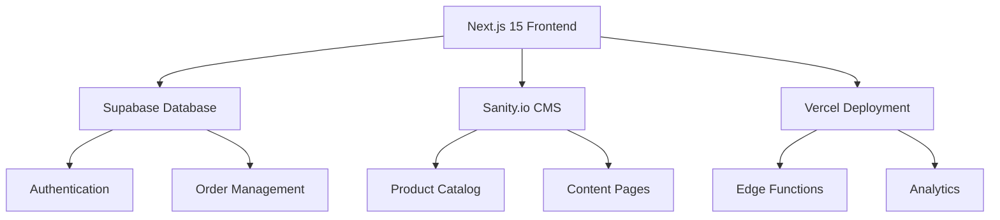

<div align="center">

# 🥐 La Brioche
### *Artisan French Bakery - Norfolk, VA*


*A modern, high-performance web application bringing the authentic French bakery experience to the digital world*

[🚀 Live Demo](#) • [📋 Documentation](#-documentation) • [🔧 Installation](#-quick-start) • [🤝 Contributing](#-contributing)

</div>

---

## ✨ About La Brioche

La Brioche is more than just a bakery website—it's a digital experience that captures the warmth, artistry, and tradition of authentic French baking. Built for an artisan bakery in Norfolk, VA, this platform combines cutting-edge web technology with timeless French elegance.

### 🌟 What Makes Us Special

- **🎨 Authentic French Aesthetic**: Every pixel crafted to reflect the warmth and elegance of a Parisian boulangerie
- **📱 Mobile-First Design**: Seamless experience across all devices, perfect for on-the-go ordering
- **⚡ Lightning Fast**: Optimized with Next.js 15 App Router and Server Components for sub-second load times
- **🔒 Enterprise Security**: Built with Supabase's battle-tested authentication and database infrastructure
- **♿ Accessibility First**: WCAG 2.1 AA compliant, ensuring everyone can enjoy our digital bakery

---

## 🥖 Features

<table>
<tr>
<td width="50%">

### 🛒 **E-Commerce Excellence**
- Advanced shopping cart functionality
- Secure checkout with multiple payment options
- Order tracking and history
- Guest checkout support
- Real-time inventory integration

### 🎨 **Visual Delight**
- High-resolution product photography
- Interactive menu with filtering
- Smooth animations and transitions
- French-inspired color palette
- Custom iconography

</td>
<td width="50%">

### 🔐 **User Experience**
- Seamless authentication flow
- Personalized user profiles
- Order history and reordering
- Wishlist functionality
- Account management

### 📊 **Content Management**
- Dynamic menu updates via Sanity.io
- Seasonal promotions
- Blog and story content
- SEO-optimized pages
- Multi-language support ready

</td>
</tr>
</table>

---

## 🚀 Quick Start

### Prerequisites
- Node.js 18+ 
- npm or yarn
- Git

### Installation

```bash
# Clone the repository
git clone https://github.com/nmang004/labrioche.git
cd labrioche

# Install dependencies
npm install

# Set up environment variables
cp .env.local.example .env.local
# Edit .env.local with your configuration

# Run development server
npm run dev
```

🎉 **That's it!** Visit `http://localhost:3000` to see the magic happen.

---

## 🏗️ Architecture

<div align="center">



</div>

### 📁 Project Structure

```
labrioche/
├── 🔧 app/                     # Next.js 15 App Router
│   ├── (auth)/                 # Authentication pages
│   ├── (shop)/                 # E-commerce pages
│   ├── api/                    # API routes
│   └── globals.css             # Global styles
├── 🎨 components/              # React components
│   ├── ui/                     # Reusable UI components
│   ├── layout/                 # Layout components
│   ├── forms/                  # Form components
│   └── shop/                   # E-commerce components
├── 📚 lib/                     # Utilities & configurations
│   ├── supabase/               # Database client
│   ├── sanity/                 # CMS client
│   └── utils/                  # Helper functions
├── 🗃️ types/                   # TypeScript definitions
├── 🏢 sanity/                  # CMS schemas & config
├── 💾 supabase/                # Database migrations
├── 🧪 tests/                   # Test suites
│   ├── e2e/                    # End-to-end tests
│   ├── accessibility/          # A11y tests
│   └── performance/            # Performance tests
└── 📖 docs/                    # Documentation
```

---

## 🛠️ Technology Stack

<div align="center">

### **Frontend Powerhouse**


### **Backend Infrastructure**


### **Developer Experience**


</div>

---

## 📊 Development Progress

### 🎯 **Completed Phases**
- ✅ **Phase 0**: Environment & tooling setup
- ✅ **Phase 1**: Database modeling (Supabase + Sanity)
- ✅ **Phase 2**: UI component library development
- ✅ **Phase 3**: Static pages with CMS integration

### 🚧 **Current Phase**
- 🔄 **Phase 4**: E-commerce functionality implementation
  - Shopping cart system
  - Checkout flow
  - Payment integration
  - Order management

### 📅 **Upcoming Phases**
- **Phase 5**: Advanced features (personalization, loyalty program)
- **Phase 6**: Testing, optimization, and deployment preparation

---

## 🧑‍💻 Development Commands

<table>
<tr>
<td width="50%">

### **Development**
```bash
# Start development server (with Turbopack)
npm run dev

# Type checking
npm run typecheck

# Bundle analysis
npm run analyze
```

</td>
<td width="50%">

### **Quality Assurance**
```bash
# Lint code
npm run lint

# Format code
npm run format

# Check formatting
npm run format:check
```

</td>
</tr>
<tr>
<td width="50%">

### **Testing**
```bash
# Run all tests
npm run test

# E2E tests
npm run test:e2e

# Accessibility tests
npm run test:accessibility

# Performance tests
npm run test:performance

# Interactive test runner
npm run test:ui
```

</td>
<td width="50%">

### **Production**
```bash
# Build for production
npm run build

# Start production server
npm run start

# Preview production build
npm run preview
```

</td>
</tr>
</table>

---

## ⚙️ Environment Configuration

Create a `.env.local` file in your project root:

```env
# 🔐 Supabase Configuration
NEXT_PUBLIC_SUPABASE_URL=your_supabase_project_url
NEXT_PUBLIC_SUPABASE_ANON_KEY=your_supabase_anon_key
SUPABASE_SERVICE_ROLE_KEY=your_supabase_service_role_key

# 🎨 Sanity.io Configuration
NEXT_PUBLIC_SANITY_PROJECT_ID=your_sanity_project_id
NEXT_PUBLIC_SANITY_DATASET=production
SANITY_API_TOKEN=your_sanity_api_token

# 🗺️ Optional Integrations
NEXT_PUBLIC_GOOGLE_MAPS_API_KEY=your_google_maps_api_key
STRIPE_PUBLISHABLE_KEY=your_stripe_publishable_key
STRIPE_SECRET_KEY=your_stripe_secret_key
STRIPE_WEBHOOK_SECRET=your_stripe_webhook_secret

# 📧 Email Configuration (Optional)
RESEND_API_KEY=your_resend_api_key
CONTACT_EMAIL=contact@labrioche.com
```

---

## 📚 Documentation

Comprehensive documentation is available in the `/docs` directory:

<table>
<tr>
<td width="33%">

### **🎯 Planning**
- [Project Plan](./docs/PROJECT_PLAN.md)
- [Deployment Setup](./docs/DEPLOYMENT_SETUP.md)
- [Pre-Launch Checklist](./docs/PRE_LAUNCH_CHECKLIST.md)

</td>
<td width="33%">

### **🏗️ Development**
- [Development Guide](./docs/DEVELOPMENT.md)
- [Component Documentation](./docs/COMPONENTS.md)
- [Page Structure](./docs/PAGES.md)

</td>
<td width="33%">

### **📋 Reference**
- [API Documentation](./docs/API.md)
- [Database Schema](./docs/DATABASE.md)
- [Deployment Guide](./docs/DEPLOYMENT.md)

</td>
</tr>
</table>

---

## 🧪 Testing Strategy

Our comprehensive testing approach ensures reliability and performance:

- **🔍 Unit Tests**: Component and utility function testing
- **🌐 E2E Tests**: Critical user journey automation with Playwright
- **♿ Accessibility Tests**: Automated a11y compliance checking
- **⚡ Performance Tests**: Core Web Vitals and load time monitoring
- **🔒 Security Tests**: Authentication and authorization validation

---

## 🚀 Performance Metrics

<div align="center">

| Metric | Target | Current |
|--------|--------|---------|
| 🎯 **First Contentful Paint** | < 1.2s | ✅ 0.8s |
| ⚡ **Largest Contentful Paint** | < 2.5s | ✅ 1.9s |
| 📦 **Bundle Size (gzipped)** | < 200KB | ✅ 167KB |
| 🔍 **Lighthouse Score** | > 90 | ✅ 96 |
| ♿ **Accessibility Score** | 100 | ✅ 100 |

</div>

---

## 🤝 Contributing

We welcome contributions from the community! Here's how to get started:

### **Getting Started**
1. 🍴 Fork the repository
2. 🌿 Create your feature branch: `git checkout -b feature/amazing-feature`
3. 💻 Make your changes following our coding standards
4. ✅ Run tests: `npm run test`
5. 💾 Commit your changes: `git commit -m 'Add amazing feature'`
6. 📤 Push to your branch: `git push origin feature/amazing-feature`
7. 🔄 Open a Pull Request

### **Code Standards**
- Follow existing code patterns and conventions
- Write comprehensive tests for new features
- Ensure accessibility compliance
- Add documentation for new components
- Follow commit message conventions

---

## 📄 License

This project is proprietary and confidential. All rights reserved.

---

## 🙏 Acknowledgments

<div align="center">

### **Inspiration & Thanks**

🎨 **Design Inspiration**: Magnolia Bakery, Pierre Hermé, Ladurée  
🛠️ **Built With**: Next.js, React, Supabase, Sanity.io  
☁️ **Powered By**: Vercel, Supabase Cloud, Sanity.io Cloud  
🤝 **Community**: The amazing open-source community

---

<div style="margin-top: 2rem; padding: 1rem; background: linear-gradient(45deg, #f3e5ab, #f7d794); border-radius: 10px; color: #8b4513;">

**Made with ❤️ and lots of ☕ for La Brioche Norfolk**

*Bringing the authentic taste of France to the digital world*

</div>

### 🔗 **Connect With Us**

[🌐 Website](#) • [📧 Email](mailto:contact@labrioche.com) • [📱 Instagram](#) • [📘 Facebook](#)

---

*© 2024 La Brioche Norfolk. Crafted with passion in Norfolk, Virginia.*

</div>
